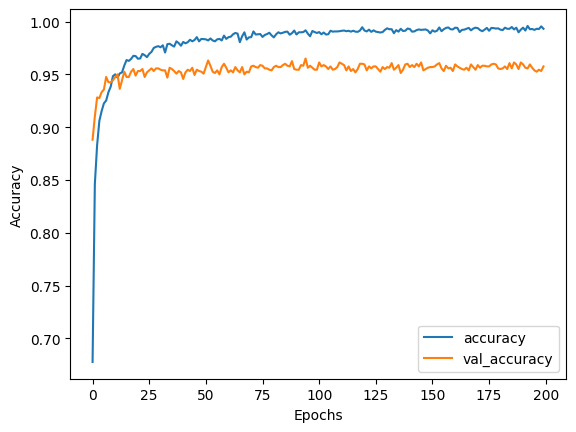
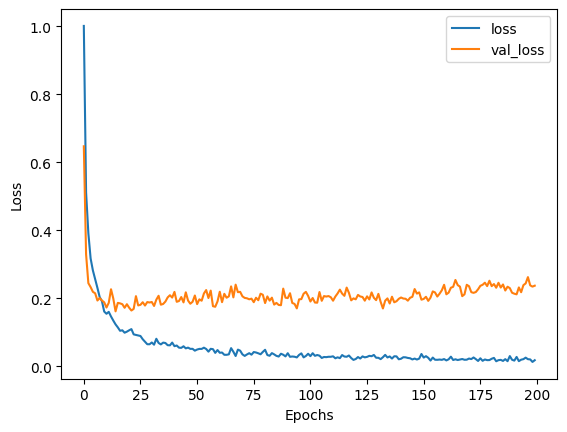

# Digit Recognition with TensorFlow

A hands‑on walkthrough of training a neural network to recognise handwritten digits from the **MNIST** dataset.

## 🗂 Project Structure
```

Digit_Recognition.ipynb ← Jupyter notebook (train + evaluate)  
Data/ ← Unzipped MNIST images + `labels.json`  
mnist_model.h5 ← Pre‑trained model for quick inference  
accuracy.png ‑ loss.png ← Training curves

```

## ✨ Key Features
- Fully‑connected neural network (Keras) reaching **98 %+** test accuracy.  
- Notebook shows training progress, evaluation metrics, and sample predictions.  
- Pre‑trained `mnist_model.h5` so you can skip training if you wish.

## 🚀 Quick Start
1. Clone the repo & install deps  
   ```bash
   pip install tensorflow matplotlib
   ```

2. Open **`Digit_Recognition.ipynb`** and run all cells.
    
    - If `Data/` isn’t extracted yet, unzip `Digit_Recognition.zip` first.
        

## 📊 Results

 

## 🛡 License

MIT
